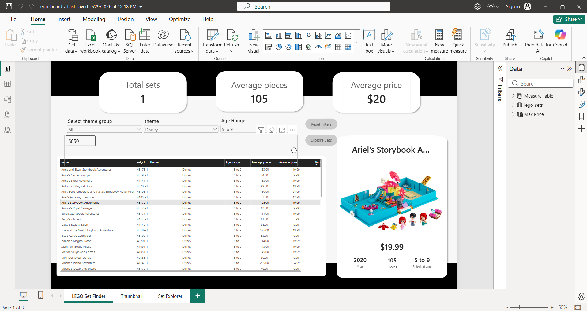

# LEGO Set Explorer | Power BI

## Project Overview
Interactive Power BI report designed to help users explore and compare
LEGO sets based on theme, age range, price and number of pieces.

## Tools
- Power BI
- Power Query
- DAX

## Data Preparation
- Removed unnecessary fields
- Filtered records with missing price, age, pieces or image values
- Reviewed and corrected data types
- Created Age Range conditional categories
- Created Price Range conditional categories

## DAX & Analysis
Created measures for:
- Total Sets
- Average Pieces
- Average Price
- Dynamic selected-set information

## Dashboard Features
- Theme group, theme and age-range slicers
- Price range parameter
- Interactive LEGO set table
- Dynamic set-detail panel
- LEGO set images from image URLs
- Report-page image tooltips on hover
- Decomposition Tree
- Reset filters button

## Key KPIs
- 4,385 LEGO sets
- 411 average pieces
- $45 average price

## Skills Demonstrated
- Data cleaning with Power Query
- Conditional columns
- DAX measures
- Interactive report design
- Dynamic filtering
- Report-page tooltips
- Image URLs
- Parameters
- Decomposition Trees
- Power BI UI/UX design

## Data Source
Maven Analytics LEGO Sets dataset.
